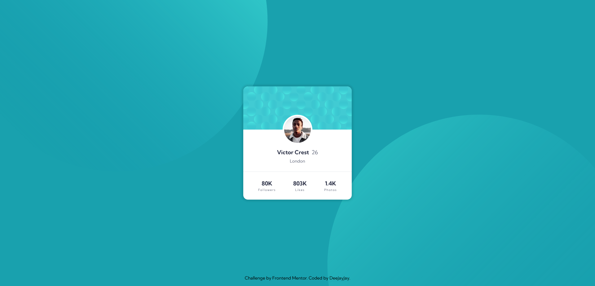

# Profile Card Component

`Author:` Deepak Joy Jose  
`Last updated on:` 2022/07/19

This is a solution to the [Profile card component challenge on Frontend Mentor](https://www.frontendmentor.io/challenges/profile-card-component-cfArpWshJ). Frontend Mentor challenges help you improve your coding skills by building realistic projects.

## Table of contents

- [Profile Card Component](#profile-card-component)
  - [Table of contents](#table-of-contents)
    - [The challenge](#the-challenge)
    - [Screenshot](#screenshot)
    - [Links](#links)
  - [My process](#my-process)
    - [Built with](#built-with)
    - [What I learned](#what-i-learned)
  - [Author](#author)

### The challenge

The challenge was to build out a profile card component that mathes the provided design and get it looking as close to the design as possible.

### Screenshot



### Links

- [Solution URL](https://github.com/deejayjay/Profile-Card-Component)
- [Live Site URL](https://main--deejayjay-profile-card-component.netlify.app/)

## My process

### Built with

- Semantic HTML5 markup
- Scss
- Flexbox
- CSS Grid
- Mobile-first workflow
- Responsive Web Design
- CSS Pseudo Elements

### What I learned

I tried using the pseudo elements `::before` and `::after` for displaying background images for the first time and thought that was cool.

See what I did below:

```scss
body::before {
  background: url("../assets/images/bg-pattern-top.svg") right 0 bottom 45vh;
  left: 0;
}

body::after {
  background: url("../assets/images/bg-pattern-bottom.svg") top 45vh left 0;
  right: 0;
}

body::before,
body::after {
  content: "";
  background-repeat: no-repeat;
  background-color: $dark-cyan;
  width: 50%;
  height: 100vh;
  position: absolute;
}
```

## Author

| Platform        | Link                                                          |
| --------------- | ------------------------------------------------------------- |
| Github          | [@deejayjay](https://github.com/deejayjay/)                   |
| Frontend Mentor | [@deejayjay](https://www.frontendmentor.io/profile/deejayjay) |
| Twitter         | [@deejay_the_dev](https://twitter.com/deejay_the_dev)         |
